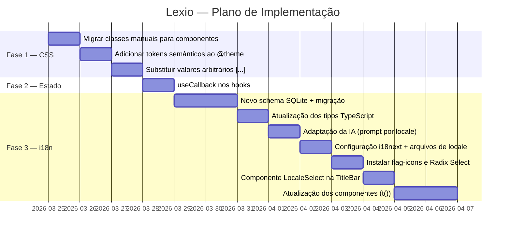

# Lexio — Implementation Plan

> Baseado na análise da conversa de 2026-03-24.  
> Três frentes independentes, priorizadas por impacto imediato.

---

## Fase 1 — Estabilização CSS / Tailwind

### Diagnóstico

O projeto convive com **três sistemas de estilo simultâneos**, o que gera inconsistência e dificulta manutenção:

| Sistema | Onde aparece | Problema |
|---|---|---|
| Classes CSS manuais | `.section-label`, `.app-body`, `.divider` em [globals.css](file:///c:/Users/nssbs/Desktop/Projetos%20Pessoais/lexio/src/renderer/styles/globals.css) | Duplicam responsabilidade com Tailwind |
| Tokens Tailwind via `@theme` | `--color-text-primary`, `--font-serif`, etc. | ✅ Correto — manter |
| Utilities Tailwind arbitrárias | `text-[42px]`, `text-[13px]`, `gap-[5px]` | Ignoram os tokens; hardcoded |

### Regra a adotar

> **Tudo via `@theme` + utilities Tailwind com nome semântico. Zero valores `[...]` e zero classes CSS manuais fora de layout estrutural.**

### Ações

#### 1.1 — Eliminar classes CSS manuais de componentes

Converter `.section-label` e `.divider` em **componentes React reutilizáveis** mínimos:

```tsx
// src/renderer/components/SectionLabel.tsx
export function SectionLabel({ children }: { children: React.ReactNode }) {
  return (
    <p className="font-sans text-[10px] font-medium tracking-[1.2px] uppercase text-text-faint mb-2">
      {children}
    </p>
  )
}

// src/renderer/components/Divider.tsx
export function Divider() {
  return <hr className="border-none h-px bg-border-subtle mb-4" />
}
```

Manter em [globals.css](file:///c:/Users/nssbs/Desktop/Projetos%20Pessoais/lexio/src/renderer/styles/globals.css) apenas o **layout estrutural** (`.app-window`, `.app-body`, scrollbar) que não pertence a nenhum componente específico.

#### 1.2 — Substituir valores arbitrários por tokens nomeados

Adicionar ao `@theme` em [globals.css](file:///c:/Users/nssbs/Desktop/Projetos%20Pessoais/lexio/src/renderer/styles/globals.css):

```css
@theme {
  /* Tipografia — escala semântica */
  --text-word-title: 42px;    /* palavra principal */
  --text-meaning:   17px;     /* significado PT */
  --text-example:   13px;     /* exemplos e meaning_en */
  --text-meta:      12px;     /* pos, nav */
  --text-label:     10px;     /* section labels, badges */

  /* Raios — já existem, garantir uso */
  --radius-sm: 4px;
  --radius-md: 6px;
  --radius-lg: 8px;
}
```

Substituir no JSX:
```diff
- className="font-serif text-[42px] font-semibold"
+ className="font-serif text-word-title font-semibold"

- className="w-[5px] h-[5px] gap-[5px]"
+ className="w-1.5 h-1.5 gap-1.5"
```

#### 1.3 — Verificação final

Após as substituições, rodar busca por `[` no JSX para garantir que não restaram valores arbitrários:

```bash
grep -rn "\[" src/renderer --include="*.tsx" --include="*.ts"
```

Qualquer resultado que não seja importação ou type assertion deve ser convertido para token.

---

## Fase 2 — Estabilização do Estado React

### Diagnóstico

O `useEffect` em [App.tsx](file:///c:/Users/nssbs/Desktop/Projetos%20Pessoais/lexio/src/renderer/App.tsx) tem dependências que mudam a cada render:

```tsx
// App.tsx — linha 21-24 (PROBLEMA)
useEffect(() => {
  if (activeTab === 'saved') fetchSaved()
  if (activeTab === 'history' || activeTab === 'search') fetchHistory()
}, [activeTab, fetchSaved, fetchHistory])  // ← fetchSaved e fetchHistory são novas refs a cada render
```

`fetchSaved` e `fetchHistory` em [useWords.ts](file:///c:/Users/nssbs/Desktop/Projetos%20Pessoais/lexio/src/renderer/hooks/useWords.ts) não são memoizadas, causando re-execuções desnecessárias do effect.

### Ações

#### 2.1 — Memoizar callbacks em `useWords`

```tsx
// src/renderer/hooks/useWords.ts
import { useState, useCallback } from 'react'

export function useWords() {
  const fetchSaved = useCallback(async () => {
    // ...
  }, [])  // sem deps — a fn não muda nunca

  const fetchHistory = useCallback(async () => {
    // ...
  }, [])

  // ...
}
```

#### 2.2 — Avaliar Zustand (condicional)

**Pré-condição:** Fazer apenas se o app ganhar mais de 5 componentes que consomem estado compartilhado.

Zustand resolveria o prop-drilling atual onde [search](file:///c:/Users/nssbs/Desktop/Projetos%20Pessoais/lexio/src/renderer/hooks/useSearch.ts#12-45), `word`, `history` são passados de [App.tsx](file:///c:/Users/nssbs/Desktop/Projetos%20Pessoais/lexio/src/renderer/App.tsx) para baixo. Instalação e store básico:

```bash
npm install zustand
```

```ts
// src/renderer/store/lexio.store.ts
import { create } from 'zustand'
import type { Word } from '../../types'

interface LexioStore {
  word: Word | null
  loading: boolean
  error: string | null
  search: (term: string) => Promise<void>
}

export const useLexioStore = create<LexioStore>((set) => ({
  word: null,
  loading: false,
  error: null,
  search: async (term) => { /* ... */ }
}))
```

> [!NOTE]
> Por enquanto, o projeto tem apenas 2 hooks ([useSearch](file:///c:/Users/nssbs/Desktop/Projetos%20Pessoais/lexio/src/renderer/hooks/useSearch.ts#6-58), `useWords`) e 8 componentes. O `useCallback` da fase 2.1 resolve o problema imediato sem adicionar dependência.

---

## Fase 3 — Internacionalização (i18n)

### Princípio de Design

> O **conteúdo aprendido** (palavra em inglês, fonética, sinônimos, contextos) é **invariante de locale**.  
> A **língua de interface e de explicação** (significados, traduções dos exemplos, labels da UI) é **variável**.

### Locales suportados (v1)

| Código | Língua |
|---|---|
| `pt-BR` | Português Brasileiro (padrão atual) |
| `en` | English (interface e significados em inglês) |
| [es](file:///c:/Users/nssbs/Desktop/Projetos%20Pessoais/lexio/src/main/db.ts#107-115) | Español |

### Arquitetura

```
src/
├── renderer/
│   ├── i18n/
│   │   ├── index.ts              ← configuração do i18next
│   │   └── locales/
│   │       ├── pt-BR.json        ← strings da UI em PT
│   │       ├── en.json           ← strings da UI em EN
│   │       └── es.json           ← strings da UI em ES
│   └── hooks/
│       └── useLocale.ts          ← hook p/ ler/gravar locale
├── main/
│   └── db.ts                     ← schema atualizado
└── types/
    └── index.ts                  ← tipos atualizados
```

---

### 3.1 — Atualização do Schema SQLite

#### Schema atual (problema)

```sql
CREATE TABLE words (
  meaning_pt  TEXT NOT NULL,  -- hardcoded PT
  meaning_en  TEXT,           -- hardcoded EN
  examples    TEXT,           -- JSON: [{en, pt}] — hardcoded PT
  ...
);
```

#### Schema novo

```sql
-- Nova tabela de traduções por locale
CREATE TABLE word_translations (
  id          INTEGER PRIMARY KEY AUTOINCREMENT,
  word        TEXT NOT NULL COLLATE NOCASE,
  locale      TEXT NOT NULL,          -- 'pt-BR', 'en', 'es'
  meaning     TEXT NOT NULL,          -- significado nesse locale
  examples    TEXT,                   -- JSON: [{en, translation}]
  created_at  TEXT DEFAULT (datetime('now')),
  FOREIGN KEY (word) REFERENCES words(word) ON DELETE CASCADE,
  UNIQUE (word, locale)
);

-- Tabela words mantém apenas o que é universal
CREATE TABLE words (
  id          INTEGER PRIMARY KEY AUTOINCREMENT,
  word        TEXT NOT NULL UNIQUE COLLATE NOCASE,
  phonetic    TEXT,
  pos         TEXT,
  level       TEXT,
  synonyms    TEXT,    -- JSON: string[] — universal
  contexts    TEXT,    -- JSON: string[] — universal
  created_at  TEXT DEFAULT (datetime('now')),
  last_viewed TEXT DEFAULT (datetime('now')),
  view_count  INTEGER DEFAULT 1,
  is_saved    INTEGER DEFAULT 0
);
```

> [!IMPORTANT]
> A migração deve preservar os dados existentes. O campo `meaning_pt` atual vira um registro [(word, 'pt-BR', meaning_pt)](file:///c:/Users/nssbs/Desktop/Projetos%20Pessoais/lexio/src/renderer/App.tsx#15-120) em `word_translations`. Os exemplos `{en, pt}` viram `{en, translation}` no mesmo registro.

#### Script de migração

```sql
-- Executar uma única vez no init() do db.ts
CREATE TABLE IF NOT EXISTS word_translations (
  id       INTEGER PRIMARY KEY AUTOINCREMENT,
  word     TEXT NOT NULL COLLATE NOCASE,
  locale   TEXT NOT NULL,
  meaning  TEXT NOT NULL,
  examples TEXT,
  FOREIGN KEY (word) REFERENCES words(word) ON DELETE CASCADE,
  UNIQUE (word, locale)
);

-- Migrar dados existentes
INSERT OR IGNORE INTO word_translations (word, locale, meaning, examples)
SELECT word, 'pt-BR', meaning_pt, examples FROM words;

-- Remover colunas legacy (SQLite 3.35+, Electron usa versão recente)
ALTER TABLE words DROP COLUMN meaning_pt;
ALTER TABLE words DROP COLUMN meaning_en;
ALTER TABLE words DROP COLUMN examples;
```

---

### 3.2 — Atualização dos Tipos TypeScript

```ts
// src/types/index.ts

export type Locale = 'pt-BR' | 'en' | 'es'

export interface WordExample {
  en: string
  translation: string  // era "pt", agora é locale-aware
}

export interface WordTranslation {
  locale: Locale
  meaning: string
  examples: WordExample[]
}

// Word agora carrega a tradução do locale ativo
export interface Word {
  id?: number
  word: string
  phonetic: string | null
  pos: PartOfSpeech | null
  level: WordLevel | null
  synonyms: string[]
  contexts: string[]
  translation: WordTranslation  // ← locale atual
  created_at?: string
  last_viewed?: string
  view_count?: number
  is_saved?: 0 | 1
}

// O que a IA retorna para um locale específico
export type AIWordResponse = {
  word: string
  phonetic: string | null
  pos: PartOfSpeech | null
  level: WordLevel | null
  synonyms: string[]
  contexts: string[]
  meaning: string          // nesse locale
  examples: WordExample[]  // tradução nesse locale
}
```

---

### 3.3 — Adaptação da Camada de IA ([ai.ts](file:///c:/Users/nssbs/Desktop/Projetos%20Pessoais/lexio/src/renderer/lib/ai.ts))

O prompt passa a ser parametrizado por locale:

```ts
// src/renderer/lib/ai.ts

const LOCALE_INSTRUCTIONS: Record<Locale, string> = {
  'pt-BR': 'Responda com significado e exemplos traduzidos em português brasileiro.',
  'en':    'Answer with meaning and example translations in English.',
  'es':    'Responde con el significado y ejemplos traducidos al español.',
}

const buildPrompt = (word: string, locale: Locale): string => `
Para a palavra inglesa "${word}", retorne exatamente este JSON:
{
  "word": "${word}",
  "phonetic": "transcrição IPA",
  "pos": "verb|noun|adjective|adverb|phrase|idiom",
  "level": "Basic|Intermediate|Advanced|Technical",
  "meaning": "significado neste locale — ${LOCALE_INSTRUCTIONS[locale]}",
  "synonyms": ["word1", "word2"],
  "contexts": ["Business", "Technology"],
  "examples": [
    {"en": "sentence in English", "translation": "tradução no locale"},
    {"en": "second example",      "translation": "tradução"},
    {"en": "third example",       "translation": "tradução"}
  ]
}
`

export async function fetchWordFromAI(word: string, locale: Locale): Promise<AIWordResponse> {
  // ...mesma lógica atual, mas passa o prompt parametrizado
}
```

> [!NOTE]
> `synonyms` e `contexts` continuam sendo retornados em inglês pela IA, pois são tags universais (não precisam de tradução — são utilizados como filtros, não como texto de leitura).

---

### 3.4 — Configuração do `i18next` (UI strings)

#### Instalação

```bash
npm install i18next react-i18next
```

#### Arquivo de configuração

```ts
// src/renderer/i18n/index.ts
import i18n from 'i18next'
import { initReactI18next } from 'react-i18next'
import ptBR from './locales/pt-BR.json'
import en   from './locales/en.json'
import es   from './locales/es.json'

i18n
  .use(initReactI18next)
  .init({
    lng: 'pt-BR',          // padrão
    fallbackLng: 'pt-BR',
    resources: {
      'pt-BR': { translation: ptBR },
      'en':    { translation: en   },
      'es':    { translation: es   },
    },
    interpolation: { escapeValue: false },
  })

export default i18n
```

#### Estrutura do arquivo de locale (`pt-BR.json`)

```json
{
  "nav": {
    "search":  "Busca",
    "saved":   "Salvos",
    "history": "Histórico"
  },
  "search": {
    "placeholder": "Busque uma palavra em inglês...",
    "recent":      "Histórico recente",
    "empty":       "Sua busca aparecerá aqui."
  },
  "word": {
    "save":    "Salvar",
    "saved":   "Salvo",
    "meaning": "Significado",
    "examples":"Exemplos"
  },
  "status": {
    "online":  "Online",
    "offline": "Offline"
  },
  "settings": {
    "language": "Idioma da interface"
  }
}
```

#### Uso nos componentes

```tsx
import { useTranslation } from 'react-i18next'

export function Nav({ ... }) {
  const { t } = useTranslation()
  return (
    <nav>
      <button>{t('nav.search')}</button>
      <button>{t('nav.saved')}</button>
    </nav>
  )
}
```

---

### 3.5 — Hook `useLocale`

```ts
// src/renderer/hooks/useLocale.ts
import { useCallback } from 'react'
import { useTranslation } from 'react-i18next'
import type { Locale } from '../../types'

// Locale é persistido em localStorage para sobreviver ao restart
const LOCALE_KEY = 'lexio_locale'

export function useLocale() {
  const { i18n } = useTranslation()

  const locale = i18n.language as Locale

  const setLocale = useCallback((next: Locale) => {
    localStorage.setItem(LOCALE_KEY, next)
    i18n.changeLanguage(next)
  }, [i18n])

  return { locale, setLocale }
}
```

O `i18n.init` leria o valor persistido:

```ts
lng: (localStorage.getItem('lexio_locale') as Locale) ?? 'pt-BR',
```

---

### 3.6 — Atualização do [useSearch](file:///c:/Users/nssbs/Desktop/Projetos%20Pessoais/lexio/src/renderer/hooks/useSearch.ts#6-58)

```ts
// src/renderer/hooks/useSearch.ts
import { useLocale } from './useLocale'

export function useSearch() {
  const { locale } = useLocale()

  const search = async (term: string) => {
    // ...
    // 1. Busca no DB: getWord(term, locale)
    const localWord = await window.lexio.getWord(term, locale)
    if (localWord) { setWord(localWord); return }

    // 2. Se não existir para esse locale, chama IA
    const aiResponse = await fetchWordFromAI(term, locale)

    // 3. Salva com locale
    const saved = await window.lexio.saveWord(aiResponse, locale)
    setWord(saved)
  }
}
```

> [!IMPORTANT]
> `window.lexio.getWord` passa a receber `locale`. O DB procura primeiro em `word_translations` para [(word, locale)](file:///c:/Users/nssbs/Desktop/Projetos%20Pessoais/lexio/src/renderer/App.tsx#15-120). Se não encontrar para o locale solicitado (mas a palavra existe), chama a IA apenas para a tradução, sem duplicar os dados universais.

---

### 3.7 — Dropdown de Locale com Radix UI Select

O seletor de idioma será um **dropdown compacto** exibindo apenas a bandeira do locale ativo, sem label de texto. Para garantir acessibilidade (navegação por teclado, ARIA, focus trap), usar o primitivo `@radix-ui/react-select` — sem precisar do Shadcn completo.

#### Instalação

```bash
npm install @radix-ui/react-select
```

#### Componente `LocaleSelect`

```tsx
// src/renderer/components/LocaleSelect.tsx
import * as Select from '@radix-ui/react-select'
import 'flag-icons/css/flag-icons.min.css'
import { useLocale } from '../hooks/useLocale'
import type { Locale } from '../../types'

const LOCALE_OPTIONS: { value: Locale; countryCode: string; label: string }[] = [
  { value: 'pt-BR', countryCode: 'br', label: 'Português' },
  { value: 'en',    countryCode: 'us', label: 'English'   },
  { value: 'es',    countryCode: 'es', label: 'Español'   },
]

export function LocaleSelect() {
  const { locale, setLocale } = useLocale()
  const active = LOCALE_OPTIONS.find(o => o.value === locale)!

  return (
    <Select.Root value={locale} onValueChange={(v) => setLocale(v as Locale)}>
      {/* Trigger — exibe apenas a bandeira do locale atual */}
      <Select.Trigger
        aria-label="Idioma da interface"
        className="flex items-center justify-center w-7 h-7 rounded-sm
                   bg-transparent border border-transparent
                   hover:border-border-subtle hover:bg-surface-hover
                   transition-colors cursor-pointer focus:outline-none"
      >
        <Select.Value asChild>
          <span className={`fi fi-${active.countryCode} text-base`} />
        </Select.Value>
      </Select.Trigger>

      {/* Dropdown */}
      <Select.Portal>
        <Select.Content
          position="popper"
          sideOffset={6}
          className="bg-surface-raised border border-border-subtle rounded-md
                     shadow-sm py-1 z-50 min-w-[140px]"
        >
          <Select.Viewport>
            {LOCALE_OPTIONS.map(opt => (
              <Select.Item
                key={opt.value}
                value={opt.value}
                className="flex items-center gap-2.5 px-3 py-2 text-sm
                           text-text-secondary cursor-pointer
                           hover:bg-surface-hover focus:bg-surface-hover
                           focus:outline-none transition-colors"
              >
                <span className={`fi fi-${opt.countryCode} text-base`} />
                <Select.ItemText>{opt.label}</Select.ItemText>
              </Select.Item>
            ))}
          </Select.Viewport>
        </Select.Content>
      </Select.Portal>
    </Select.Root>
  )
}
```

> [!NOTE]
> O `LocaleSelect` deve ser posicionado na **TitleBar** ou na **StatusBar**, onde há espaço sem interferir no fluxo de leitura. A TitleBar é a escolha mais natural — ficará no canto direito, antes dos controles de janela.

---

### 3.8 — Bandeiras com `flag-icons`

A biblioteca `flag-icons` fornece ~260 bandeiras como classes CSS com SVGs inline — funciona perfeitamente no Electron, sem problema de renderização no Windows (diferente dos emojis de bandeira, que no Windows são renderizados como letras).

#### Instalação

```bash
npm install flag-icons
```

#### Uso

```tsx
import 'flag-icons/css/flag-icons.min.css'

// Bandeira retangular (padrão)
<span className="fi fi-br" />   {/* 🇧🇷 */}
<span className="fi fi-us" />   {/* 🇺🇸 */}
<span className="fi fi-es" />   {/* 🇪🇸 */}

// Bandeira circular
<span className="fi fi-br fis" />
```

Os códigos de país seguem o padrão **ISO 3166-1 alpha-2** em minúsculas. Referência completa em [flagicons.lipis.dev](https://flagicons.lipis.dev).

#### Dimensionamento no contexto do Lexio

```tsx
// Tamanho recomendado para o dropdown — proporcional à tipografia
<span className="fi fi-br text-base leading-none" />   // ~16px
<span className="fi fi-br text-lg leading-none" />    // ~18px — bom para o trigger
```

> [!TIP]
> O Vite inclui automaticamente apenas o CSS das classes usadas no build. Não há necessidade de preocupação com o tamanho da biblioteca (~130KB total) — na prática, apenas 3-4 bandeiras serão incluídas no bundle final.

---

### 3.9 — Settings Screen (locale picker)

Com o `LocaleSelect` da seção 3.7, não é necessária uma tela de configurações separada para o idioma. O dropdown na TitleBar é o suficiente.

Se no futuro houver outras preferências (atalho de teclado, tema, etc.), criar uma tela de configurações dedicada acessível via menu do system tray:

```tsx
import { useLocale } from '../hooks/useLocale'
import { LocaleSelect } from './LocaleSelect'

export function Settings() {
  return (
    <div className="app-body">
      <p className="section-label">{t('settings.language')}</p>
      {/* Reutiliza o mesmo componente do TitleBar */}
      <LocaleSelect />
    </div>
  )
}
```

---

## Ordem de Execução Recomendada



## Checklist de Conclusão

- [ ] **F1:** Zero classes CSS manuais em componentes (`SectionLabel`, `Divider` viram componentes React)
- [ ] **F1:** Zero valores `[...]` Tailwind no JSX
- [ ] **F2:** `fetchSaved` e `fetchHistory` memoizados com `useCallback`
- [ ] **F3:** Tabela `word_translations` criada; dados PT-BR migrados
- [ ] **F3:** Tipos `Locale`, `AIWordResponse`, `WordTranslation` definidos
- [ ] **F3:** [ai.ts](file:///c:/Users/nssbs/Desktop/Projetos%20Pessoais/lexio/src/renderer/lib/ai.ts) parametriza prompt por locale
- [ ] **F3:** [getWord(word, locale)](file:///c:/Users/nssbs/Desktop/Projetos%20Pessoais/lexio/src/main/db.ts#44-54) e `saveWord(data, locale)` implementados no IPC
- [ ] **F3:** `i18n/locales/*.json` com todas as strings da UI
- [ ] **F3:** Todos os componentes usando `t()` para strings hardcoded
- [ ] **F3:** `flag-icons` instalado; bandeiras renderizando corretamente no Windows
- [ ] **F3:** `@radix-ui/react-select` instalado; `LocaleSelect` implementado
- [ ] **F3:** `LocaleSelect` posicionado na TitleBar com comportamento de dropdown correto
- [ ] **F3:** Troca de locale reflete imediatamente em toda a UI (i18n) e nas próximas buscas (IA)
